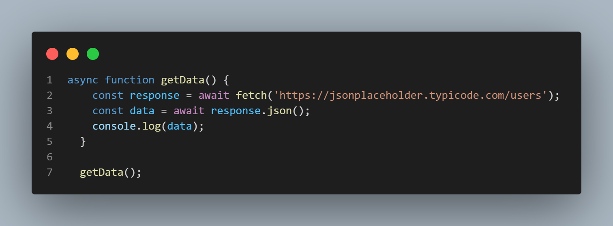
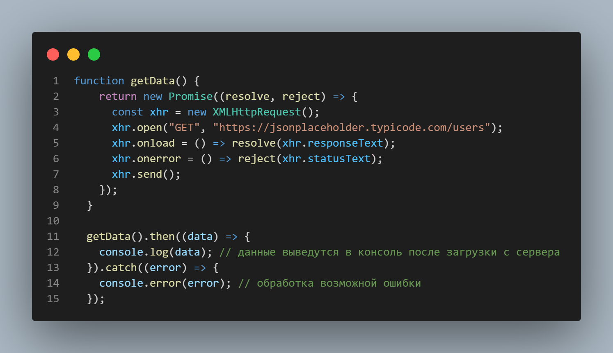
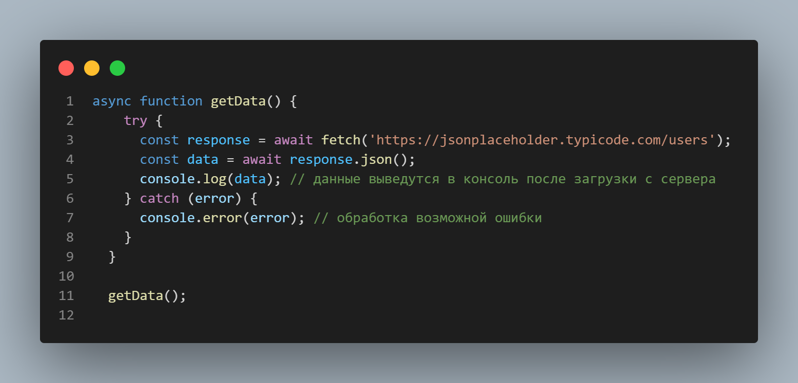
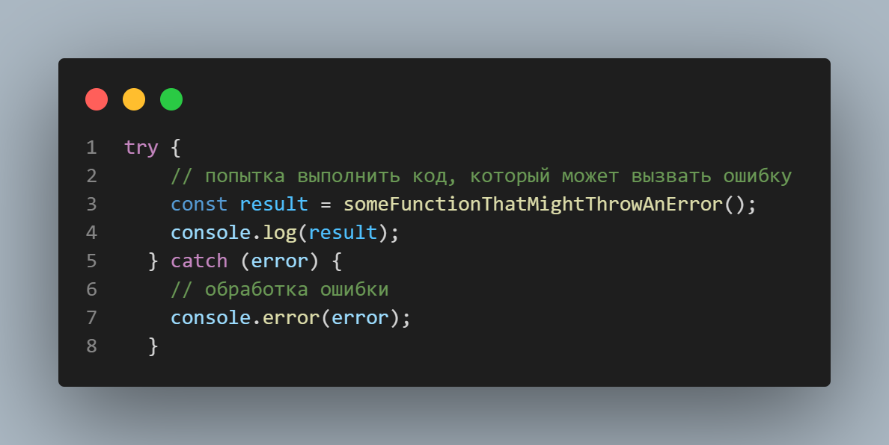
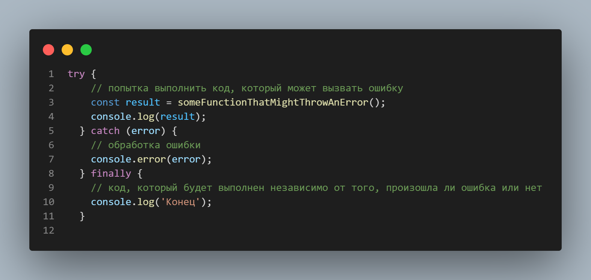

### SYNCHRONOUS

**что такое синхроный js?**

***Синхронный JavaScript*** -  означает, что выполнение кода блокирует интерфейс пользователя до завершения задачи. Это означает, что JavaScript выполняется последовательно, поэтому скрипт не перейдет к следующей задаче, пока не завершится текущая. Как результат, пользователь может иметь ощущение, что интерфейс завис, если задача занимает длительное время для выполнения. В то время как, асинхронный код не блокирует интерфейс пользователя, поскольку задачи выполняются параллельно, что улучшает производительность и позволяет управлять несколькими задачами одновременно.

**что такое асинхронный js?** 

***Асинхронный JavaScript*** - Асинхронный JavaScript означает, что выполнение кода JavaScript продолжается без блокировки интерфейса пользователя, даже если некоторые задачи занимают длительное время для выполнения. Это достигается с помощью callback-функций, Promise и async/await. В отличие от синхронного кода, асинхронный код не блокирует интерфейс и может выполнять несколько задач одновременно. Например, когда пользователь запрашивает данные с сервера, асинхронный код позволяет продолжить работу с интерфейсом, пока данные загружаются. После завершения загрузки, асинхронный код обрабатывает полученные данные. Это позволяет создавать более отзывчивые и быстрые приложения.

### ***Promise in js***

`Promise` в JavaScript - это механизм, позволяющий обрабатывать асинхронный код. Это объект, который представляет собой еще не выполнившееся действие или результат в будущем. `Promise` имеет три состояния: `pending` (ожидание), `fulfilled` (успешно завершено) и `rejected` (завершено с ошибкой).

Создание нового `Promise` осуществляется с помощью ключевого слова `new` и передачи в конструктор функции, которая принимает два параметра: `resolve` и `reject`, которые должны быть вызваны при завершении выполнения асинхронной операции: `resolve` вызывается, если результат успешный, и `reject` вызывается, если возникла ошибка.

Вот пример использования `Promise` для загрузки данных из удаленного сервера:

В этом примере функция `getData` возвращает новый `Promise`, который отправляет запрос к удаленному серверу с использованием объекта `XMLHttpRequest`. Когда сервер ответит, методы `resolve` или `reject` вызываются в зависимости от результатов выполнения запроса. Затем оператор `then` может быть использован для обработки результатов выполнения запроса, а `catch` для обработки ошибок.

Также существует более короткий синтаксис с использованием ключевых слов `async` и `await`:

Этот пример использует ключевые слова `async` и `await` для получения данных с сервера и обработки ошибок. Функция `fetch` возвращает `Promise`, а ключевое слово `await` ждет, пока результат не будет получен, после чего функция `json()`, также возвращающая `Promise`, извлекает данные из ответа в формате JSON. В случае возникновения ошибки, функция `catch` будет обрабатывать ее.

### Try/Catch

`try` и `catch` являются ключевыми словами в JavaScript, используемыми для обработки ошибок.

**try**-определяет блок кода, в котором возможны ошибки, которые могут вызывать исключения. Код между `try` и `catch` выполняется нормально, если никаких исключений не возникает. Если же возникает исключение, выполнение кода внутри `try` прерывается и управление передается к `catch`.

**catch** определяет блок кода, который обрабатывает исключения, вызываемые в блоке `try`. Передает в блок параметр ошибки, который может использоваться для определения причины ошибки.

Здесь выполняется `try`-блок, который вызывает функцию, которая может вызвать ошибку. Если какие-то ошибки произойдут, они будут перехвачены блоком `catch` и обработаны. В случае, если ошибки нет, код продолжит исполнение после блока `try`.

Кроме того, блок `finally` может быть добавлен в конце `try-catch` для указания кода, который должен быть выполнен независимо от того, произошла ли ошибка или нет.

Здесь блок `finally` будет выполнен независимо от того, произошла ли ошибка или нет, и будет выводить в консоль «Конец».